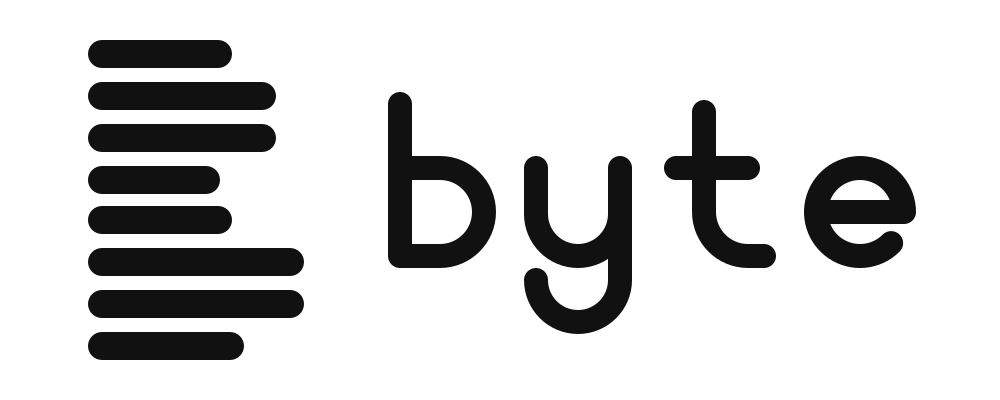

<p align="center">
  <picture>
    <source media="(prefers-color-scheme: dark)" srcset="resources/images/byte-logo-wordmark-light.svg">
    
  </picture>
</p>

# Byte
Byte is a fork of [lite](https://github.com/rxi/lite) with Git integration, an
integrated terminal and folder handling.

## Overview
lite is a lightweight text editor written mostly in Lua — it aims to provide
something practical, pretty, *small* and fast, implemented as simply as
possible; easy to modify and extend, or to use without doing either.

## Repository layout
| Path | Contents |
| --- | --- |
| `src/` | C sources: renderer, platform API, Lua, stb, terminal emulator |
| `data/` | Lua sources: `core/`, `plugins/`, `user/`, fonts |
| `resources/` | logos (`images/`), app icons and the Windows resource file |
| `scripts/` | build scripts |
| `doc/` | documentation and the license |
| `winlib/` | SDL3 for Windows builds |

## Building
Byte embeds Lua 5.5 (in `src/lib/lua/`) and links SDL 3 statically, so the
binary has no runtime SDL dependency. On Linux:

```sh
scripts/build_sdl.sh   # once: fetches SDL 3 and builds only what Byte uses
scripts/build.sh       # builds build/byte
```

`build_sdl.sh` turns off the SDL subsystems Byte never touches (audio,
joystick, haptics, sensors, camera, GPU/Vulkan, tray, ...). Without
`build/deps/sdl3`, `build.sh` falls back to a system-wide SDL 3, or to one at
`SDL3_PREFIX`.

## License
This project is free software; you can redistribute it and/or modify it under
the terms of the MIT license.

## Languages
Byte's tokenizer understands the Lite XL syntax format (multi-type patterns,
embedded languages such as HTML/CSS/JS inside PHP, `^` line-start patterns,
and simple PCRE `regex` patterns translated to Lua patterns), so Lite XL
language plugins can be dropped into `data/plugins/`. Included from
[lite-xl-plugins](https://github.com/lite-xl/lite-xl-plugins) (MIT): CMake,
diff, Go, INI, Java, Makefile, PHP, Rust, shell, TOML, TypeScript, YAML and
Zig. `syntax_extras.lua` adds more shell/Makefile file names (`.bashrc`,
`.zshrc`, `GNUmakefile`, ...). File patterns match the full path or the bare
file name.
